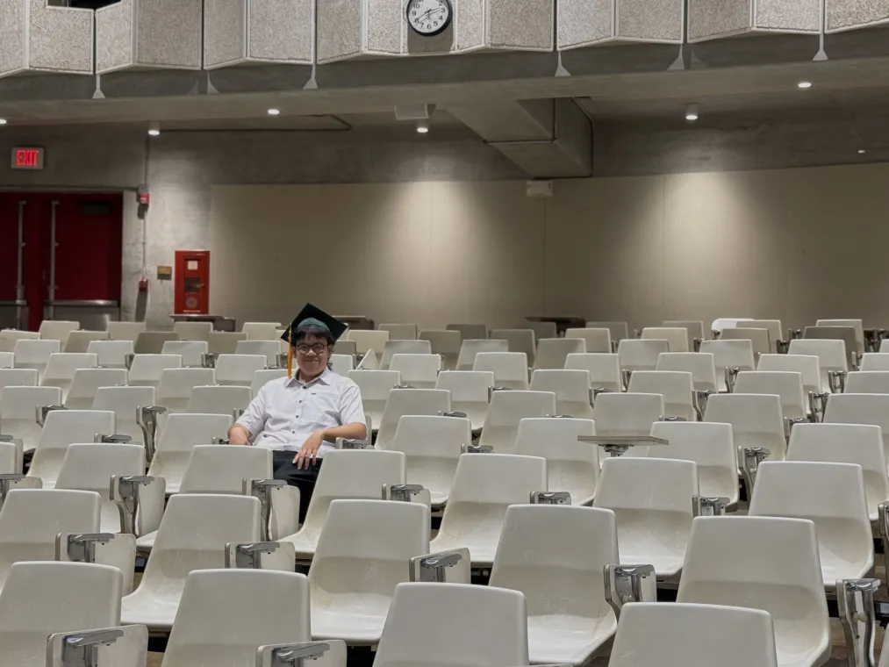

## "The end..."

  

As my last semester comes to an end, I happen to reminisce about all my previous class experiences. In particular, I realized I have learned so much about computer science that it never even occurred to me that I did not know about sorting algorithms or coding in assembly language just a few years ago. When I first learned about software engineering, it was from ICS 314. I was introduced to new topics about web development like front-end coding and back-end database management.

In this ICS 414, software engineering class, I was able to build on those skills and understand more about what it means to create software as part of a team. I learned that software engineering is not just about writing code that works. It is also about planning, organizing tasks, communicating with teammates, testing features, and making sure the code is readable and maintainable. Working on projects helped me see how important it is to break problems into smaller parts and to think about the user experience, not just the technical side.

Overall, this class helped me feel more confident as a computer science student and future developer. I learned that creating software takes patience, collaboration, and a willingness to keep improving. Even when projects were challenging, they helped me understand how real software development works. Looking back, I can see how much I have grown from the beginning of my college experience to now, and this class has been an important part of that growth.