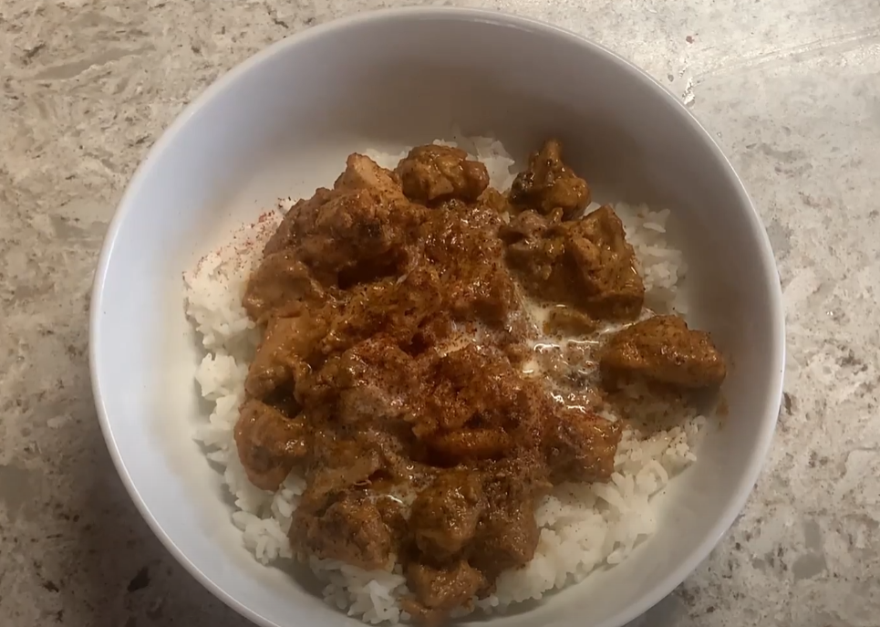

In this cooking video that I created for my Filipino class, I created a video to present in class on how to prepare and cook Butter Chicken.

The video also includes a short voice over about the history and creation of Butter Chicken.

<a href="https://drive.google.com/file/d/1oqJjkIenbRRcTnc6CLv9um_DX4_W98uj/view?usp=drive_link">Cooking Video</a>
