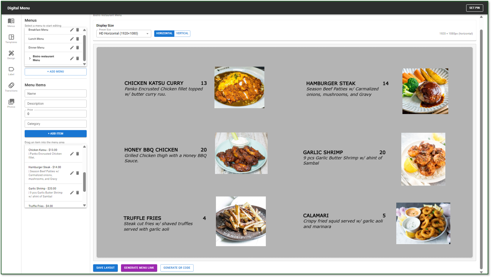
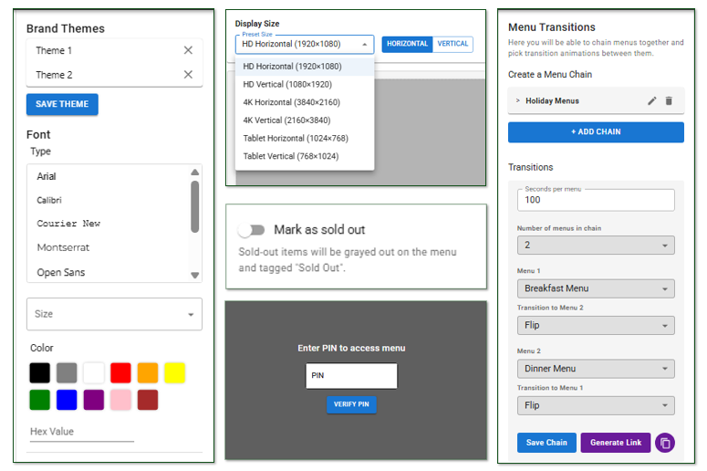

The Digital Menu Builder is a feature within the Malama GO administrative web application that enables vendors to create and manage their digital menus efficiently. The system provides tools for adding items, arranging layouts, and applying brand themes to support visually consistent menu design across devices. Vendors can use drag-and-drop editing, structured layout tools, and customizable styling to build menus that reflect their business identity. The platform also includes animated menu transitions using the Framer Motion library, which enhances the presentation of menus that change throughout the day. Together, these capabilities offer a modern and intuitive environment for designing digital menus within the Malama GO ecosystem.

  

  

