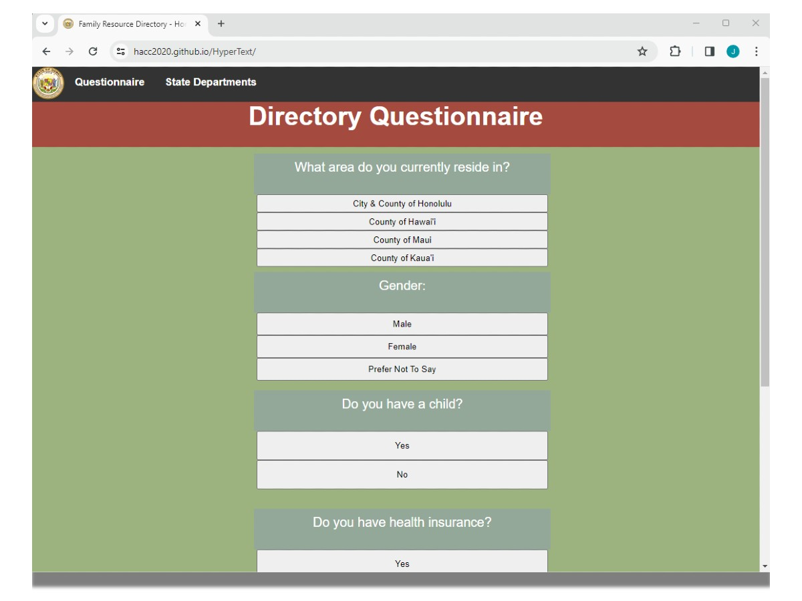

Hawaii Directory is a one stop shop directory for individuals seeking social services in Hawai`i. This group project was created for the Hawaii Annual Code Challenge for 2020. In this project my group worked on a directory for services given in Hawaii. The challenge was to make a repository that stores all programs and services from statewide government agencies and non-profit agencies.

My team had a unique idea of including a questionare within the front page of the site. The questionare was to expedite the process of individuals seeking for certain resources. I had helped developed the Directory Questionaire that gave individuals links to services that they may require. From there, individuals could look through the available resources available and redirect them to the front page of the website.

