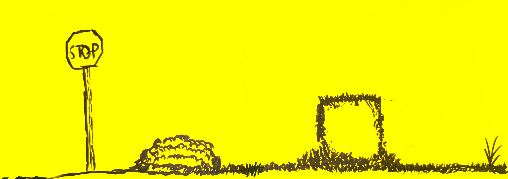

Project Color is a 2D artist/painter platformer where the player’s actions slowly paint and change the world around them. As the player explores the level, every interaction leaves a mark, whether they help, damage, ignore, or change objects and characters in the canvas-like world. These choices build up over time, creating different visual layers that show what the player has done so far. By the end of the level, the game reveals a final painting that reflects the player’s journey, showing the world they created through their gameplay, decisions, and interactions.

  

To learn more about Project Color visit [Itch.io](https://jenativi.itch.io/project-color).
