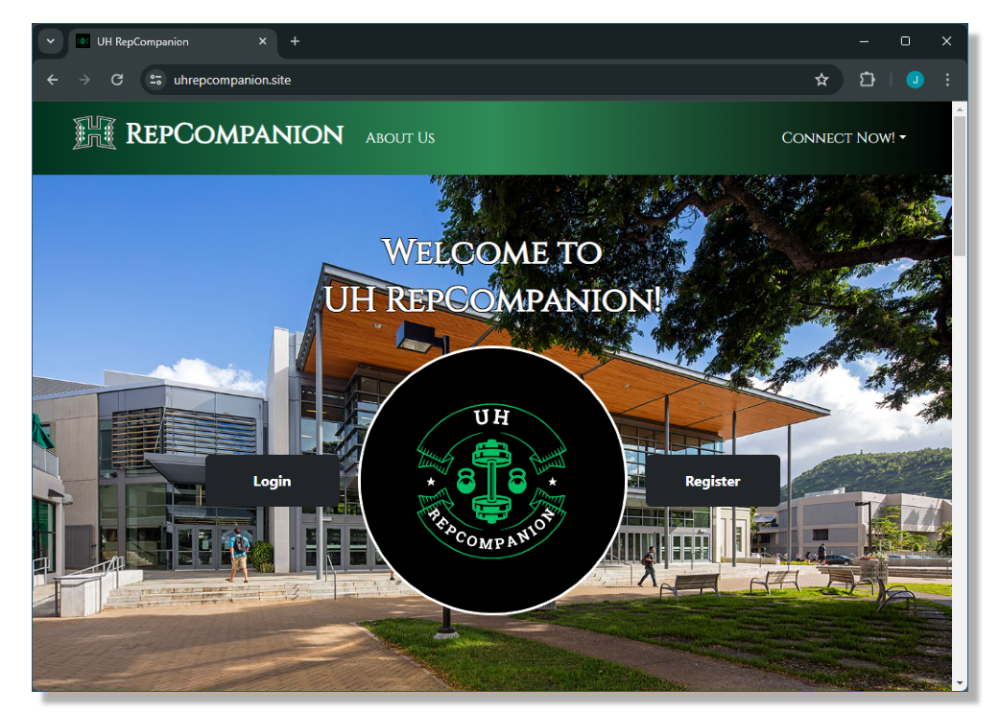

UH Repcompanion is a web-based app that was developed as part of the final project for ICS 314. This app is for University of Hawaii students who are seeking gym partners. Our goal is to help connect student gym-goers to help increase social interactions in the university and improve the lack of motivation that many students face when working out.

UH Repcompanion consists of features that help students connect. There is an event page where students can post their workout for the day which other students can join. Students can also add their workout schedules to the profile for others to see. Lastly, there is a finder page that can be filtered to find student profiles. When developing UH Repcompanion every feature was created with the thought of user experience and my group wanted to create something that can be easily used. 

  

My main involvement in this project was creating the filter feature in the Finder page of the app. The filter allowed users to quickly look up student profiles that matched their needs. The Finder page can be filtered by the person’s interest, gym proficiency, and the profile’s weekly availability. My experience with developing this feature took a lot of effort to pull off. Along with my skills, I used AI in developing the code to pull off this feature.

This project would not have been possible without the help of my group. It was a great experience working with this group and it showed what Project Management looks like when working along with others. Each team member brought unique skills and insights that enriched the project, demonstrating the power of teamwork and effective communication. This collaboration not only led to a successful outcome but also provided each of us with valuable lessons in leadership, responsibility, and mutual support.

To learn more about UH Repcompanion visit our [Organization GitHub Page](https://uh-repcompanion.github.io/).
