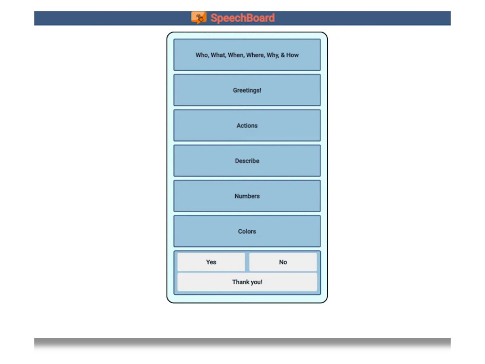

Speech Board is hackathon project created for the Congressional App Challenge in 2020. In this project my group worked on a web app for individuals with speech disabilities.

Speech Board is an app where individuals could press buttons that would speak computer generated words for them. This web app was intended for younger individuals with speech disabilities who are still learning to speak. The app was also intended for kids still learning how to speak English and help them communicate over time.

[Speech Board Project Video](https://www.youtube.com/watch?v=4SnVflmUXx4)

