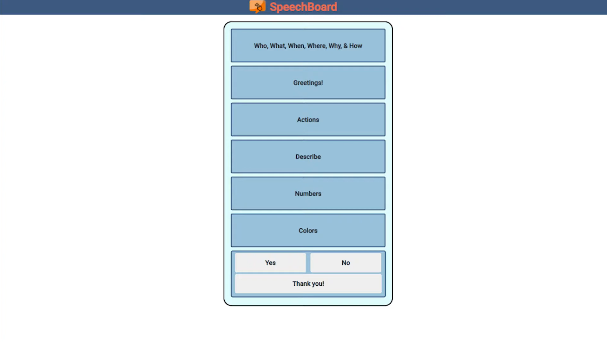

In this project my group worked on a web app for individuals with speech disabilities.

Speech Board is an app where individuals could press buttons that would speak computer generated words for them. 

